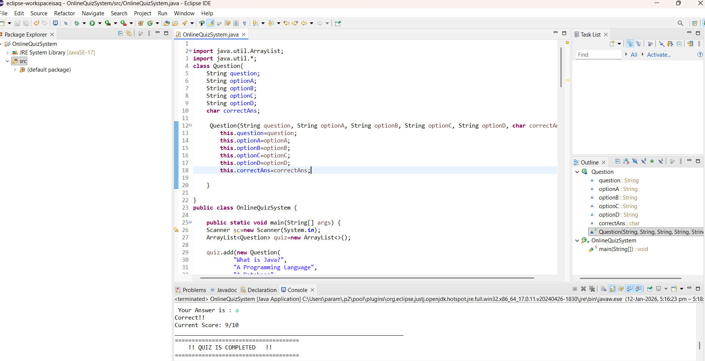

# Online Quiz System (Console-Based)

## Description
A console-based Online Quiz System developed using Core Java.
The application asks multiple-choice questions, validates user input,
calculates score, and displays the final result.

## Technologies Used
- Java (Core Java)
- Eclipse IDE

## Features
- Console-based interaction
- Multiple-choice questions
- Input validation
- Score calculation

## Sample Output

## How to Run
1. Clone the repository
2. Open the project in Eclipse
3. Run `OnlineQuizSystem.java` as Java Application
4.the sample output is:
====================================
   !!ONLINE QUIZ SYSTEM !! 
====================================
Enter Name: 
isaq
=====================================
Welcome isaq!!
TotalQuestions: 10
=====================================
Question 1:What is Java?
A) A Programming Language
B) A Database
C) An Operating System
D) A Browser

 Your Answer is : a
Correct!!
Current Score: 1/1
____________________________________________________________________
Question 2:Which keyword is used to create an object?
A) class
B) new
C) void
D) static

 Your Answer is : b
Correct!!
Current Score: 2/2
____________________________________________________________________
Question 3:Which of these is not OOP concept?
A) Inheritance
B) Encapsulation
C) Compilation
D) Polymorphism

 Your Answer is : c
Correct!!
Current Score: 3/3
____________________________________________________________________
Question 4:What does JVM stand for?
A) Java Virtual Machine
B) Java Variable Method
C) Java Verified Machine
D) Java Visual Machine

 Your Answer is : a
Correct!!
Current Score: 4/4
____________________________________________________________________
Question 5:Which memory area stores local variables and method calls?
A) Heap
B) Method Area
C) Stack
D) PC Register

 Your Answer is : c
Correct!!
Current Score: 5/5
____________________________________________________________________
Question 6:Which of the following is NOT part of JVM?
A) Class Loader
B) Execution Engine
C) Garbage Collector
D) Java Compiler

 Your Answer is : d
Correct!!
Current Score: 6/6
____________________________________________________________________
Question 7:What happens first when a Java program is executed?
A) Bytecode verification
B) JIT compilation
C) Class loading
D) Execution of main method

 Your Answer is : c
Correct!!
Current Score: 7/7
____________________________________________________________________
Question 8:Which class is mutable and NOT thread-safe?
A) String
B) StringBuffer
C) StringBuilder
D) CharSequence

 Your Answer is : c
Correct!!
Current Score: 8/8
____________________________________________________________________
Question 9:Which is used for exception handling?
A) try-catch
B) if-else
C) for loop
D) switch

 Your Answer is : b
Wrong Answer, The Corrrect Answer is:A
Current Score: 8/9
____________________________________________________________________
Question 10:Which Map allows one null key?
A) Hashtable
B) TreeMap
C) ConcurrentHashMap
D) HashMap

 Your Answer is : a
Correct!!
Current Score: 9/10
____________________________________________________________________
=====================================
    !! QUIZ IS COMPLETED   !!
=====================================

Name: isaq
Total Questions: 10
Correct Answers: 9
Wrong Answers: 1
Score: 9/10
Percentage: 90.0%
=====================================
 Thank You For Taking the Quiz
=====================================
